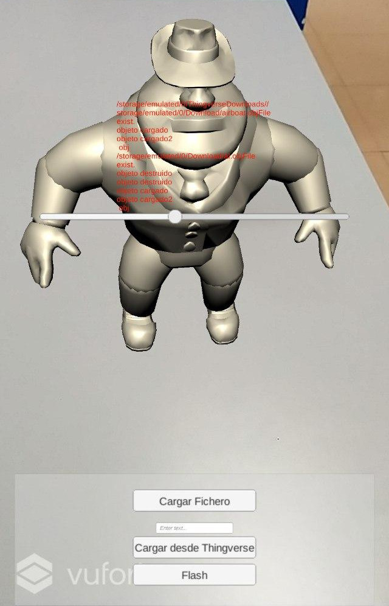

# Ar Model Viewer #
_"AR Model Viewer" se trata de una aplicación de realidad aumentada, desarrollada en Unity para Android, usando las librerías proporcionadas por Vuforia.La aplicacion principalmente facilitar la visualización de objetos 3D haciendo uso de un cuboide físico personalizado como referencia. 
El usuario puede cargar un modelo 3D desde el almacenamiento interno del móvil o desde una tarjeta SD. También tiene la posibilidad de importarlo online directamente desde Thingverse. Una vez cargado el modelo, el usuario puede manipular el cubo y rotarlo a su elección mientras desde la pantalla del móvil verá el modelo en tiempo real.

__

## Librerias Usadas 
* [ Simple File Browser ]( https://assetstore.unity.com/packages/tools/input-management/simple-file-browser-98451 ) - Gestor de ficheros usado.
* [ pb_Stl ]( https://github.com/karl-/pb_Stl) - Libreria para cargar el modelo 3d en formato stl en runtime
* [ OBJ Importer ](https://assetstore.unity.com/packages/tools/modeling/runtime-obj-importer-49547) - Libreria para cargar el modelo 3d en formato obj en runtime
* [ UniZip]( https://github.com/tsubaki/UnityZip ) Libreria para descomprimir.
